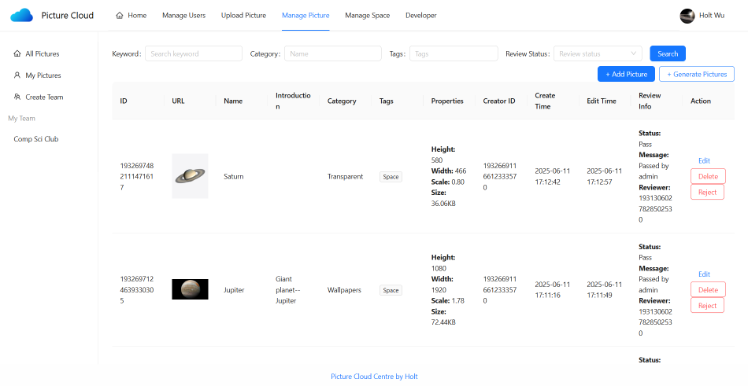

# Picture Cloud Frontend

## Overview

This project (https://www.holtwywpicloud.me) is a full-stack web application built as a personal learning exercise to explore modern web development technologies. The application features a Spring Boot backend connected to a MySQL database for managing and storing data, and utilises Vue and Ant Design for frontend interaction and visuals.

The project allows users to store pictures in both public space, private space and team space. Real-time collaborative editing on pictures is allowed within team space. The website is deployed with Heroku using AWS S3 for picture storage.

## Technologies
- JavaScript/TypeScript
- Vue
- Ant Design
- OpenAPI (development only)

## Frontend Features
### Key Features
- Authentication across different storage spaces based on different roles
- Storage service with AWS S3 
- Collaborative-editing feature in team space 

### User Management
- Users can register accounts and login
- Users can edit their profiles
- Admins can view/edit user roles and their information

### Picture Management
- Users can upload pictures to all types of storage space via url or direct upload
- Users can change rotation/sizes of their pictures
- Users can download pictures and share their QR code links
- Users can search pictures based on conditions
- Admins can pass or reject a picture upload request to public space
- Admins can fetch pictures online in batches
- Admins can view/edit/delete all pictures in public space

### Storage Space Management
- Users can analyse picture storage space in different dimensions
- Users can edit pictures collaboratively in team space
- Users can assign access level in their created team space
- Admins can manage all storage spaces
- Admins can upgrade storage space level

## Usage
1. Create an account and login.
2. Login as a default user:
    - **username:** user
    - **password:** password
3. Login as an administrator:
   - **username:** admin
   - **password:** password

## Quick Start

- **Set up:** 
  - Download and install `npm` package manager
  - Run `npm install` in the root directory
  - Add a '.env' file in the root directory with the following custom global config variables:
    - VITE_BASE_URL = "www.example.com"
    - VITE_FULL_URL = "https://www.example.com"

- **Build:** 
  - Run `npm run build` in the root directory
- **Start:**
  - Run `npm run preview` in the root directory

## Demo
Home Page

Picture Management

Collaborative Edit

Space Usage Analysis

